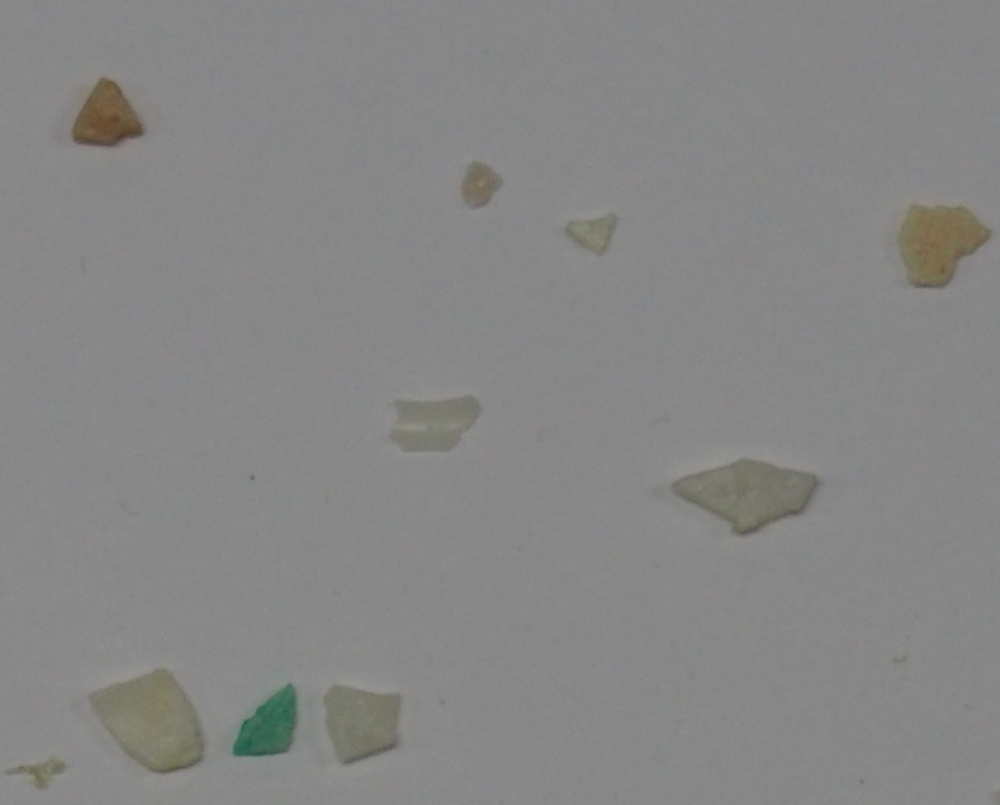
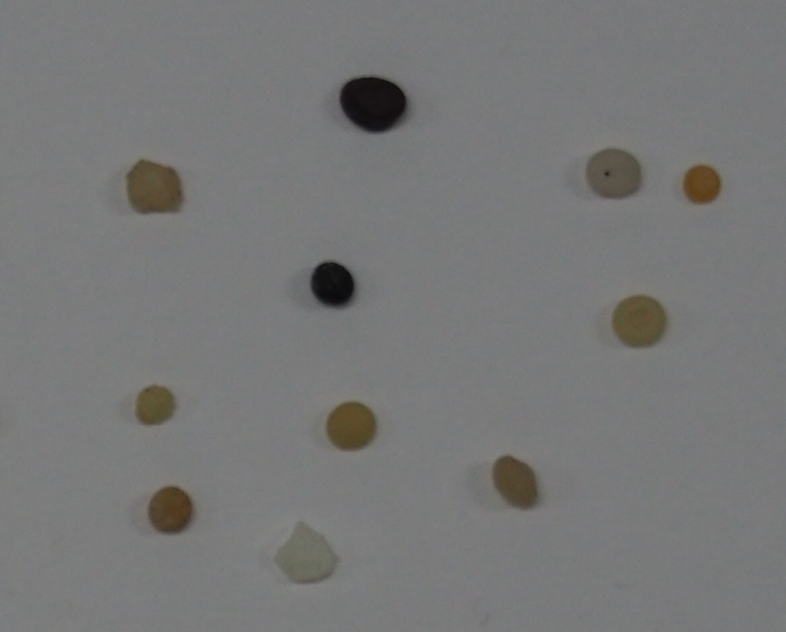
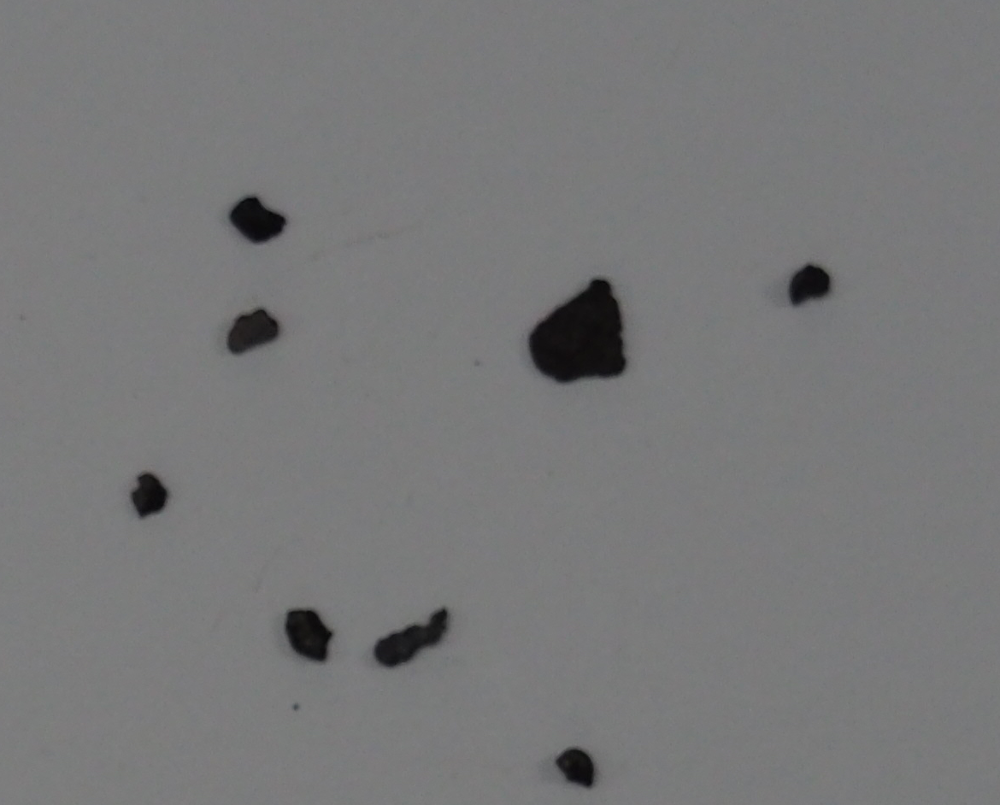

<!-- @import "design/style.css" -->

# **TERCER CONJUNTO DE TAREAS A REALIZAR**

## Índice

- [Preparativos para las tareas](#preparativos-para-las-tareas)
- [Análisis y clasificación de monedas](#análisis-y-clasificación-de-monedas)
- [Modelo de clasificador de imágenes](#modelo-clasificador-de-objetos-en-una-imagen)
- [Fuentes y Documentación](#fuentes-y-documentación)

Este segundo conjunto de tareas consiste en hacer uso de las técnicas de **[Sobel](https://scispace.com/pdf/edge-detection-by-modified-otsu-method-167ccq2st7.pdf)** con **[Otsu](https://learnopencv.com/otsu-thresholding-with-opencv/)** y de **[Canny](https://docs.opencv.org/4.x/da/d22/tutorial_py_canny.html)** para obtener los bordes de las imágenes para tratar con ellas tanto en vídeo capturado por la WebCam como para mostrar información obtenida a partir de una [imagen](../VC_P2/Resources/mandril.jpg).

## Preparativos para las tareas

Para la realización de las siguientes tareas, se va a utilizar el mismo *enviroment* de Python llamado VC_P1 creado en el [primer conjunto de tareas](../VC_P1/Exercises_P1.ipynb), la única dependencia adicional que se ha de descargar es la que viene dada por los siguientes paquetes:

```bash
pip install scikit-learn seaborn
pip install scikit-image
```

## Análisis y Clasificación de Monedas

En esta tarea se requería **individualizar la suma de las monedas** presentes en la imagen.

En primer lugar, se visualiza la imagen y se muestran los bordes de las monedas individuales. Al usuario se le pide que haga clic sobre la **moneda de referencia**, que es la de 10 céntimos.

Se calcula el radio en píxeles de esta moneda y se compara con su diámetro real para **obtener la escala de píxeles por milímetro ($\text{px}/\text{mm}$)**. Posteriormente, con esta información, se estima el valor de cada moneda detectada. Finalmente, se suman los valores y se imprime el resultado en pantalla.

### Funciones Clave y Preprocesamiento

En particular, en este código se definen tres funciones útiles y se realiza un preprocesamiento de la imagen.

### Funciones Útiles

* **`fit_circle_kasa(pts)`:** Para encontrar el círculo que **mejor se ajusta** a una serie de puntos del contorno.

* **`median_radius_from_center(center, contour)`:** Para calcular el radio utilizando la **mediana** de las distancias desde el centro, lo que lo hace más robusto a las imperfecciones del contorno.

* **`nms_candidates(cands, ...)`:** Útil porque si el mismo objeto (moneda) se detecta con dos contornos ligeramente diferentes (y, por lo tanto, dos candidatos), esta función mantiene solo el candidato con el radio mayor y **descarta aquellos superpuestos** que están demasiado cerca (Non-Maximum Suppression).

### Preprocesamiento de la Imagen

El preprocesamiento consiste en aplicar los siguientes pasos para mejorar la detección de bordes:

1.  **CLAHE (Contrast Limited Adaptive Histogram Equalization):** Algoritmo para **uniformizar la iluminación y el contraste** en las diversas áreas, compensando sombras o reflejos.

2.  **Filtro Bilateral:** **Remueve el ruido** manteniendo los bordes nítidos.

3.  **Desenfoque Gaussiano (Blur Gaussiano):** Un ligero desenfoque para **estabilizar** los subsiguientes algoritmos de detección de bordes.

4.  **Umbralización Adaptativa y Morfología:**
    * **`cv2.adaptiveThreshold`:** Crea una **imagen binaria** (blanco/negro) que resalta las regiones de las monedas. Es adaptativo, por lo que el umbral de luminosidad cambia según el área de la imagen.

    * **Operaciones Morfológicas (`cv2.morphologyEx`):** Se aplican operaciones de **cierre** (`MORPH_CLOSE`) para rellenar pequeños *gaps* o agujeros dentro de los contornos de las monedas, y de **apertura** (`MORPH_OPEN`) para remover pequeños ruidos.

La imagen resultante (`th_closed`) es una **máscara binaria** que idealmente muestra las monedas como manchas blancas y el resto como negro; sobre esta última se realizan las sucesivas operaciones para **encontrar los contornos**.

### Observaciones sobre Resultados

Al variar las imágenes de entrada del programa, observamos que:

* Con ["Monedas"](../VC_P3/Resources/Monedas.jpg), los contornos de las monedas se detectan correctamente, y se asocian todos los valores correctos excepto por la moneda de 20 céntimos, que se clasifica como un euro (lo que indica un posible error de medición o clasificación en esa instancia).


* Con ["Img1"](../VC_P3/Resources/Img1.jpeg), las monedas **no se detectan correctamente**, probablemente porque el soporte sobre el que se tomó la foto no es rígido y uniforme.


* Mientras que con ["Img4"](../VC_P3/Resources/Img4.jpeg), el programa detecta la mayoría de las monedas, pero con algunos **falsos positivos**.


## Modelo clasificador de objetos en una imagen

Para la realización de la tarea a tratar se van a importar diversas librerias y paquetes necesarios para el tratamiento de las imágenes, para la extracción de características y para el entrenamiento y evaluación de los resultados obtenidos mediante el modelo de clasificación de las partículas.

```python
import cv2
import numpy as np
import pandas as pd
from pathlib import Path
import matplotlib.pyplot as plt
import seaborn as sns
from sklearn.metrics import accuracy_score, confusion_matrix
```

Con las importaciones terminadas, lo primero a realizar es cargar en una variable un diccionario en donde la clave es cada uno de los objetos a encontrar en la imagen y sus valores son las imágenes dadas desde el principio para el entrenamiento del test.

### Imágenes de test de tipo **FRA**:




### Imágenes de test de tipo **PEL**:




### Imágenes de test de tipo **TAR**:




Adicionalmente, se amplia la cantidad de imágenes rotando las dadas para aumentar el tamaño muestral (1 imagen extra por cada una de las dadas)

Para la evaluación es necesario importar la imagen de prueba a usar para el test y el [csv](../VC_P3/Resources/Task2/MPs_test_bbs.csv) con los resultados correctos para compararlos con los obtenidos por el clasificador que se va a crear en base a las características obtenidas de las imágenes usadas para el test.

### Imagen de testeo del modelo:


En cuanto a la extracción de características se realiza un proceso de análisis centrado en la segmentación de los objetos y del cálculo de dos características principales como son el brillo y la circularidad de los objetos, dichas características han sido elegidas teniendo en cuenta que los objetos de tipo **PEL** son circulares y los de tipo **TAR** som muy oscuros. Los pasos seguidos por el __*extract_features*__ son los siguientes:

- Conversión a escala de grises: Después de comprobar si la entrada es no nula convierte la imagen a escala de grises.

- Conversión a HSV (Hue, Saturation, Value).

- Calcular el brillo: Se calcula la media de todos los píxeles del canal V que representa el brillo del objeto (primera de las características a procesar posteriormente).

Una vez obtenida la primera de las características se procede a la segmentación de los objetos mediante la binarización con [OTSU](https://learnopencv.com/otsu-thresholding-with-opencv/) de los mismos:

- Umbralizar: Mediante el método [OTSU](https://learnopencv.com/otsu-thresholding-with-opencv/) se encuentra el umbral óptimo que divide el fondo de los objetos y, tras esto, se invierte el resultado para obtener el fondo negro y los objetos blancos.

- Cierre morfológico: Usando la función __*cv2.MORPH_CLOSE*__ se aplica un cierre morfológico que consiste en una dilatación y una erosión con el propósito de eliminar los pequeños huecos dentro de los objetos y unir áreas cercanas para suavizar los contornos.

Con la binarización realizada, se procede a buscar los contornos de los objetos detectados mediante la función __*cv2.findContours*__.

Como última parte de la función de extracción de características se itera sobre todos los contornos detectados para calcular las propiedades inicializando una serie de acumuladores.

- Iteración y filtrado: Para cada contorno detectado se calcula el área y la longitud del perímetro después de cerrarlo.

- Cálculo de circularidad: Si el perímetro es mayor que cero se utiliza una métrica adimensional que viene dada por la siguiente fórmula (el valor = 1 es un círculo perfecto):

$$
\text{Circularidad} = \frac{4 \pi \cdot \text{Área}}{\text{Perímetro}^2}
$$

Una vez obtenido el valor de la circularidad y teniendo en cuenta todas las muestras del mismo tipo de objeto, se obtiene la media ponderada de la circularidad aplicando la siguiente métrica:

$$
\text{Circularidad con Media Ponderada} = \frac{\sum_i (\text{Circularidad}_i \cdot \text{Área}_i)}{\sum_i \text{Área}_i}
$$

Con las características extraídas y con el objetivo de hacer la clasificación de objetos por tipo, se alican 3 reglas principales, dos de ellas directamente relacionadas con las características extraídas y otro residual por si los anteriores no aplican:

- Se comprueba la circularidad del objeto y si es mayor al parámetro elegido, entonces el objeto se clasifica como **PEL**.

- En caso de no aplicarse la circularidad, se comprueba el color del objeto, en caso de ser muy oscuro (menor o igual al parámetro elegido) se clasifica como **TAR**.

- Si no se cumple ninguna de las otras reglas, se clasifica automáticamente como **FRA**.

Por último se procede a la evaluación del clasificador sobre la imagen del conjunto de pruebas y respaldando los resultados con el resultado real dentro del [csv](../VC_P3/Resources/Task2/MPs_test_bbs.csv), para ello, se realiza un recorte de [ROI (Región de Interés)](https://www.investopedia.com/terms/r/returnoninvestment.asp) y se calculan los resultados mediante una métrica de rendimiento basado en la la comparación de datos obtenidos con los reales.

## Fuentes y Documentación

- **Internet:** Se ha utilizado internet para la búsqueda de información acerca de la segmentación y diferentes métricas y características para aplicar las diferentes técnicas ([SMACC: A System for Microplastics Automatic Counting and Classification](https://ieeexplore.ieee.org/document/8976153)) con el objetivo de mejorar la precisión del modelo ejecutado en la [tarea2](#tarea-2). Además, se han buscado los *"emojis"* para los mensajes de creación de imagenes en dicha tarea.

- **Inteligencia Artificial Generativa (ChatGPT, Gemini):** Se ha utilizado la IA para intentar mejorar la precisión del modelo de obtención de características (desempeño nulo/deficiente de los resultados obtenidos con la IA).

- **Enlaces:**
    - https://ieeexplore.ieee.org/document/8976153
    - https://learnopencv.com/otsu-thresholding-with-opencv/
    - https://chatgpt.com/
    - https://gemini.google.com
    - https://www.investopedia.com/terms/r/returnoninvestment.asp

Para más documentación referente a las tareas, véase el [Notebook](Exercises_P3.ipynb) asociado a la carpeta de la práctica en cuestión **(VC_P3)**.